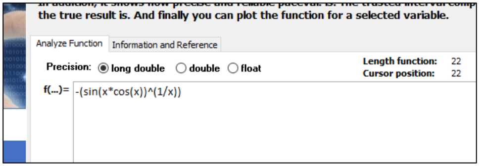
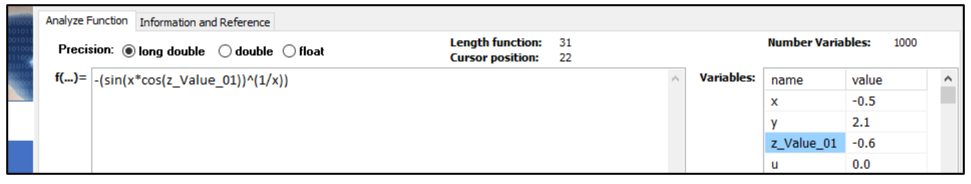
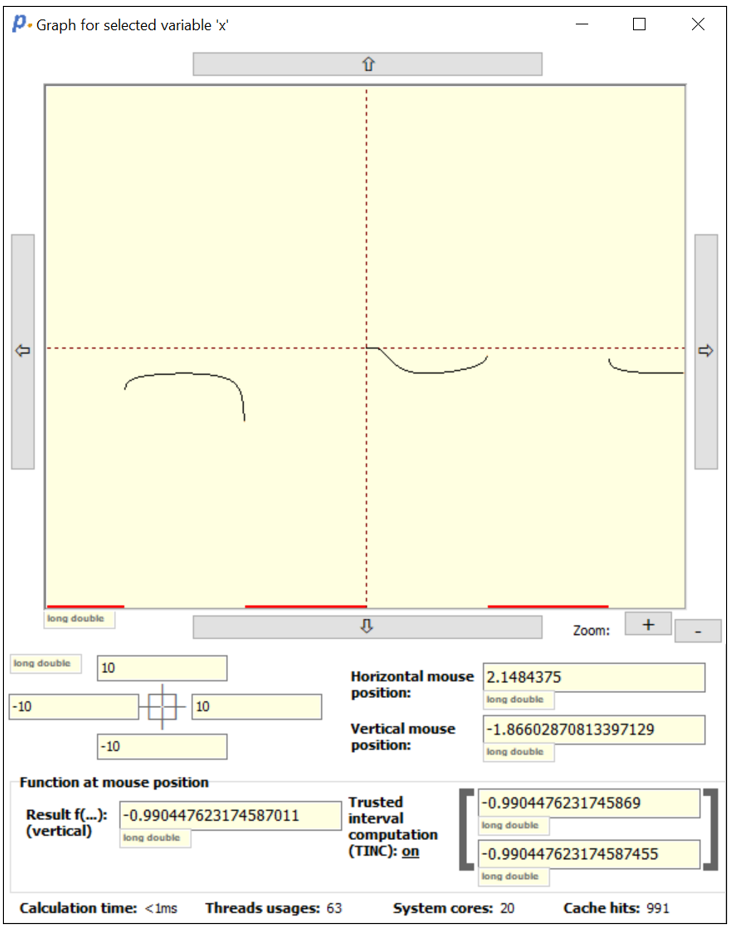

# Quick start guide for the paceval "Calculation" demo application

paceval application “Calculation” GitHub - https://github.com/paceval/paceval/tree/main/demo%20and%20examples/AppCalculation

Source paceval application “Calculation” GitHub - <https://github.com/paceval/paceval/tree/main/examples_sources/AppCalculation>

## INTRODUCTION

This demo application shows the capabilities of **pace***val.* in terms of its computational excellence. Please check the computing power and speed. In addition, it shows how precise and reliable Paceval works. The trusted interval computation "TINC" indicates the interval within which the actual result lies. And finally, you can plot the function for a selected variable.

## 1. ENTER THE FORMULA IN THE TOOL AND ADJUST THE SETTINGS

You can type or copy your formula directly into the editor next to "f(...)=". Use the standard mathematical notations, e.g. for   
  
you just type this in the editor:

```
-(sin(x*cos(x))^(1/x))
```



Just take a look at the **pace***val.* [PRODUCT BRIEF](https://paceval.com/product-brief/) or select the "Quick reference" tab for a list of all supported arithmetic expressions and functions. **pace***val.* has no limit on the length or number of variables. If you want, you can change the names of the variables in the grid. Just start with a letter (A-Z) or (a-z), subsequent characters can also be digits (0-9).



## 2. CALCULATE RESULTS

Provide the value of the variable you are interested in, then choose Calculate. When you press "Create object for computation and calculate" for the first time, the function is first analyzed, checked for errors, a cache is created and the results are displayed in "real time". If you now run the calculation again and only change the variable values, you will notice that the calculation time is now even further reduced, e.g. due to our caching methods it takes less than a millisecond. The exact speed always depends on the speed of your processor, of course.

## 3. CHECK THE PRECISION OF YOUR RESULT WITH "TINC"

Since computers are not mathematically exact, you should factor this into your calculations.

In general, **pace***val.* uses long double, double, or float precision. However, if you have a long formula and/or many variables, the result will be fuzzier even with high precision. But **pace***val.* offers a solution for this: The Trusted Interval Computation (TINC) provides a precise interval in which the "true" result can be found. Just select "On" for "Use Interval" and click "Calculate". **pace***val.* now shows a minimum and maximum value, which is the correct value. If you can't apply this in other programs, you may be surprised at the results and get into unforeseen scenarios.


## 4. DRAW AND EXAMINE THE GRAPH

You can plot the function for a selected variable by clicking “Graph for selected variable”. In our example, we drew the graph for the variable "x".

Simply zoom in and out and select left and right, up and down to explore the area of interest to you.



## 4. CHANGE THE SOURCE CODE VERSION DOWN FOR YOUR OWN NEEDS

If you download the source code version of this demo application, you can easily adapt it to your needs or use the example code in your own application. For example, you could also draw 3D graphics.

Source paceval application “Calculation” GitHub - <https://github.com/paceval/paceval/tree/main/examples_sources/AppCalculation>

Copyright © 2015-2023 paceval.® All rights reserved.  
<mailto:info@paceval.com>
