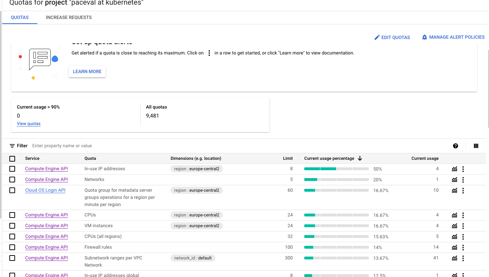

# Kubernetes Native Paceval Computation Service

## Introduction

### System Diagram


The Paceval service in k8s consist of the following components

1. Paceval API Service handle external request from user
   1. request **createComputation**: create CRD `pacevalcomputationobject` when creating computation
   2. requests **getComputation**, **getComputationResult** , **getComputationResult**, **GetComputationResultExt**,**GetComputationInformationXML**,**GetErrorInformation**:
   reserve proxy user request to respective computation object
   3. request **Demo**: forward request to demo service and create a CRD `pacevalcomputationobject` based on the request (noted that the creating of computation take some time)
   4. request **GetMultipleComputationsResults**: forward request to multiple computation object in parallel and return an array of ordered results
   5. It has healthiness and readiness endpoint for k8s to know it health status
2. Paceval computation Object
   1. This is a version of nodejs paceval-server when the function parameter (in environment variables) loaded upon started up, it is owned by CRD `pacevalcomputationobject`
   2. It has healthiness and readiness endpoint for k8s to know it health status

3. Paceval K8S operator
   1. The operator create/delete the k8s deployment, service as well as HPA (horizontal pod autoscaler) of Paceval computation Object based on the existence of  CRD `pacevalcomputationobject`
   2. It has healthiness and readiness endpoint for k8s to know it health status

4. Paceval Demo service
   1. This is a version of nodejs paceval-server when the function parameter is loaded using endpoint `createComputation`. It allow faster return of result. The function created will be delete in 2 seconds
   2. It has healthiness and readiness endpoint for k8s to know it health status

5. Delete old paceval object
   This is a k8s cronjob that triggered every 5 mins. It detect CRDs that has not been active in one hours and delete the CRD.

## Installation Step

### Prerequisite

This guide describes how to set up your own paceval-service on Kubernetes using [Google Cloud Platform (GCP)](https://cloud.google.com/) with easy-to-follow steps. However, you can adopt it for any hyperscalar such as [Amazon Web Services (AWS)](https://aws.amazon.com/) or [Microsoft Azure](http://azure.microsoft.com/).

In short, you will need this:
- Kubernetes command-line tool, [kubectl](https://kubernetes.io/docs/tasks/tools/), allows you to run commands against Kubernetes clusters.
- Access to a running Kubernetes cluster with the Cluster Administrator role [cluster-admin](https://kubernetes.io/docs/reference/access-authn-authz/rbac/#user-facing-roles) (in GCP, this also means your account must have the [Kubernetes Engine Admin](https://cloud.google.com/kubernetes-engine/docs/how-to/iam) role in IAM).

## Installation steps

As a first step, create an empty project and enable the Kubernets Engine APIs.

In GCP, creating an empty project is done through the [Google Cloud console](https://www.google.com/url?sa=t&rct=j&q=&esrc=s&source=web&cd=&cad=rja&uact=8&ved=2ahUKEwiAsPaz-qj8AhUGm_0HHV_4AjcQFnoECA0QAQ&url=https%3A%2F%2Fcloud.google.com%2Fresource-manager%2Fdocs%2Fcreating-managing-projects&usg=AOvVaw2rNNmaoita-LBuwPL3xncu). Click the Project dropdown menu, then click "NEW PROJECT".
Then select the project and [enable the Kubernetes Engine APIs](https://console.cloud.google.com/marketplace/product/google/container.googleapis.com) from the Google Cloud console.

### Connect to your kubernetes cluster

For any Kubernetes cluster, you can access the cluster from the [kubeconfig](https://kubernetes.io/docs/concepts/configuration/organize-cluster-access-kubeconfig/) file using kubectl, there is also a UI-based tool called [Lens](https://k8slens.dev/).

To connect to a cluster in GCP, specifically install the [Google Cloud CLI (gcloud CLI)](https://cloud.google.com/sdk/docs/install). Start the Google Cloud CLI and [install kubectl](https://cloud.google.com/kubernetes-engine/docs/how-to/cluster-access-for-kubectl) (the gke-gcloud-auth-plugin will also be installed):
```shell
gcloud components install kubectl
```

To generate the kubeconfig entry, run this:
```shell
gcloud container clusters get-credentials <cluster-name> --region=<region-name>
```

For example:
```shell
gcloud container clusters get-credentials autopilot-cluster-1 --region=europe-central2
```

You can test the configuration with this:
```shell
kubectl get namespaces
```

### Install paceval operator
To install, run the following command
```shell
kubectl apply -f examples_sources/NodeJS_examples/k8s/operator/template/operator-manifest.yaml
```
and wait for deployment to be complete
```shell
kubectl get deployment operator-controller-manager -n operator-system        
NAME                          READY   UP-TO-DATE   AVAILABLE   AGE
operator-controller-manager   1/1     1            1           99s
```

If `Ready` is 1/1 then it is ready

### Install paceval API service
To install, run the following command
```shell
kubectl apply -f examples_sources/NodeJS_examples/k8s/pacevalAPIService/chart/api-service-manifest.yaml
```
and wait for deployment to be complete
```shell
kubectl get deployment api-service-apiservice                                                          
NAME                     READY   UP-TO-DATE   AVAILABLE   AGE
api-service-apiservice   1/1     1            1           20s
```

### Install paceval demo service
To install, run the following command
```shell
kubectl apply -f examples_sources/NodeJS_examples/k8s/demoService/chart/demo-service-manifest.yaml
```
and wait for deployment to be complete
```shell
kubectl get deployment demo-service-demoservice
NAME                       READY   UP-TO-DATE   AVAILABLE   AGE
demo-service-demoservice   1/1     1            1           100s
```

### Wait/Check for API Service external IP Address Allocation

It may take a few minutes for the LoadBalancer's external IP address to be available.
You can view the status with this command (use Ctrl + C to end the command):

```shell
kubectl get svc api-service-apiservice
```

You will get an output similar to this:

```shell
NAME                     TYPE           CLUSTER-IP    EXTERNAL-IP    PORT(S)        AGE
api-service-apiservice   LoadBalancer   10.49.7.202   34.118.106.7   80:30726/TCP   5m
```

## Call the paceval-service endpoint

Note down your LoadBalancer's external IP address (see EXTERNAL-IP above).
Now the paceval-service is deployed on your Kubernetes cluster and you can make a test call as follows (use your LoadBalancer's external IP address):

```shell
curl --location --request GET '<EXTERNAL-IP>/Demo/?functionString=x%2Ay-z&numberOfVariables=3&variables=x%3By%3Bz&values=0.534346%3B2%3B45.4536&interval=yes'
```

You will get a response similar to this from your paceval-service:

```shell
{"error-message":"No error has occurred for this computation object (PACEVAL_ERR_NO_ERROR).","error-position":"","error-type":"[NO ERROR]","error-type-number":0,"handle_pacevalComputation":"6dd3ac29-beb3-11ed-989c-a2a45b63c3f5","interval-max-result":"-44.384908","interval-min-result":"-44.384908","result":"-44.384908","time-calculate":"0.000203s","version-number":4.04}
```

## Limitation for GCP Autopilot K8s cluster
1. When cluster resource (e.g. vCPU, memory) is not sufficient when installing/use service. GCP automatically trys to add more VM into the cluster (i.e. scale out). The process take time. So you can find occasionally your computation object take mins to be ready.
2. There is a quota limit in GCP where your cluster are not allowed to scale up beyond the limit. In this case, please request to Google to increase the quotas.

For details, see reference [here](https://cloud.google.com/compute/resource-usage?_ga=2.58764011.-75868254.1678303802&_gac=1.156671177.1678389429.Cj0KCQiApKagBhC1ARIsAFc7Mc6pL5xk0PfPUtgXTWQmokAHkssCS_WzA087GiRw3Miou6V4LuUZ7zQaAuvjEALw_wcB#requesting_additional_quota)


## API Definition
Refer to the new [openAPI definition](swagger.yaml) for the APIs.
