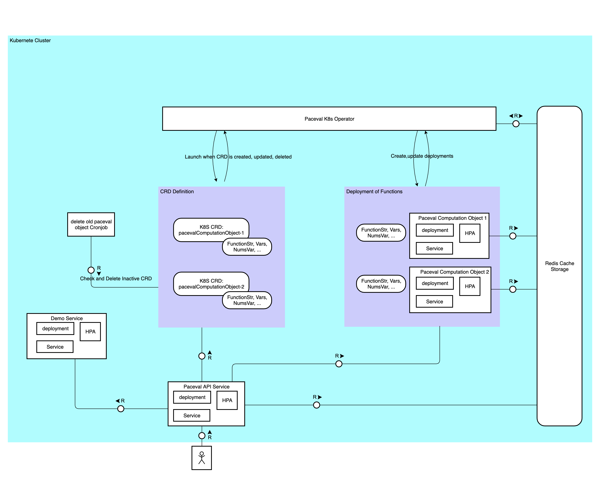

# Guide for deploying the Kubernetes native paceval-service on any cluster

## Introduction

### System diagram


## Prerequisite

This guide describes how to set up your own paceval-service on Kubernetes using [Google Cloud Platform (GCP)](https://cloud.google.com/) with easy-to-follow steps. However, you can adopt it for any hyperscalar such as [Amazon Web Services (AWS)](https://aws.amazon.com/) or [Microsoft Azure](http://azure.microsoft.com/).

In short, you will need this:
- Kubernetes command-line tool, [kubectl](https://kubernetes.io/docs/tasks/tools/), allows you to run commands against Kubernetes clusters.
- Access to a running Kubernetes cluster with the Cluster Administrator role [cluster-admin](https://kubernetes.io/docs/reference/access-authn-authz/rbac/#user-facing-roles) (in GCP, this also means your account must have the [Kubernetes Engine Admin](https://cloud.google.com/kubernetes-engine/docs/how-to/iam) role in IAM).

## Installation steps

As a first step, create an empty project and enable the Kubernets Engine APIs.

In GCP, creating an empty project is done through the [Google Cloud console](https://www.google.com/url?sa=t&rct=j&q=&esrc=s&source=web&cd=&cad=rja&uact=8&ved=2ahUKEwiAsPaz-qj8AhUGm_0HHV_4AjcQFnoECA0QAQ&url=https%3A%2F%2Fcloud.google.com%2Fresource-manager%2Fdocs%2Fcreating-managing-projects&usg=AOvVaw2rNNmaoita-LBuwPL3xncu). Click the Project dropdown menu, then click "NEW PROJECT".
Then select the project and [enable the Kubernetes Engine APIs](https://console.cloud.google.com/marketplace/product/google/container.googleapis.com) from the Google Cloud console.

### Create a Kubernetes cluster

In general, you have two options in [Google Cloud Platform (GCP)](https://cloud.google.com/) to create a new Kubernetes cluster.

Option 1. The easiest way to create a new Kubernetes cluster with GCP is the so-called [Autopilot mode](https://cloud.google.com/kubernetes-engine/docs/concepts/types-of-clusters). Just follow these steps for Autopilot mode: [Create an Autopilot cluster](https://cloud.google.com/kubernetes-engine/docs/how-to/creating-an-autopilot-cluster)

Option 2. If you are more experienced with configuring Kubernetes and specifically want to benefit from performance, you should use the [Standard mode](https://cloud.google.com/kubernetes-engine/docs/concepts/types-of-clusters) in GCP. To create a new cluster in Standard mode using Google Kubernetes Engine (GKE), run the following command (please replace  `<gcp-project-name>` with your own GCP project name and `<cluster-name>` with your own cluster name):

```shell
gcloud beta container --project <gcp-project-name> clusters create <cluster-name> --zone "europe-central2-a" --no-enable-basic-auth --cluster-version "1.25.6-gke.1000" --release-channel "regular" --machine-type "e2-medium" --image-type "COS_CONTAINERD" \
 --disk-type "pd-balanced" --disk-size "100" --metadata disable-legacy-endpoints=true \
 --scopes "https://www.googleapis.com/auth/devstorage.read_only","https://www.googleapis.com/auth/logging.write","https://www.googleapis.com/auth/monitoring","https://www.googleapis.com/auth/servicecontrol","https://www.googleapis.com/auth/service.management.readonly","https://www.googleapis.com/auth/trace.append" \
 --max-pods-per-node "110" --num-nodes "3" --logging=SYSTEM,WORKLOAD --monitoring=SYSTEM --enable-ip-alias --network "projects/optimal-buffer-368615/global/networks/default" --subnetwork "projects/optimal-buffer-368615/regions/europe-central2/subnetworks/default" \
 --no-enable-intra-node-visibility --default-max-pods-per-node "110" --no-enable-master-authorized-networks --addons HorizontalPodAutoscaling,HttpLoadBalancing,GcePersistentDiskCsiDriver --enable-autoupgrade --enable-autorepair --max-surge-upgrade 1 \
 --max-unavailable-upgrade 0 --enable-autoprovisioning --min-cpu 1 --max-cpu 20 --min-memory 1 --max-memory 1000 --autoprovisioning-locations=europe-central2-a --enable-autoprovisioning-autorepair --enable-autoprovisioning-autoupgrade --autoprovisioning-max-surge-upgrade 1 \
 --autoprovisioning-max-unavailable-upgrade 0 --enable-shielded-nodes --node-locations "europe-central2-a"
```

### Connect to your kubernetes cluster

For any Kubernetes cluster, you can access the cluster from the [kubeconfig](https://kubernetes.io/docs/concepts/configuration/organize-cluster-access-kubeconfig/) file using kubectl, there is also a UI-based tool called [Lens](https://k8slens.dev/).

To connect to a cluster in GCP, specifically install the [Google Cloud CLI (gcloud CLI)](https://cloud.google.com/sdk/docs/install). Start the Google Cloud CLI and [install kubectl](https://cloud.google.com/kubernetes-engine/docs/how-to/cluster-access-for-kubectl) (the gke-gcloud-auth-plugin will also be installed):
```shell
gcloud components install kubectl
```

To generate the kubeconfig entry, run this:
```shell
gcloud container clusters get-credentials <cluster-name> --region=<region-name>
```

For example:
```shell
gcloud container clusters get-credentials paceval-dev --region=europe-central2 --project optimal-buffer-368615
```

You can test the configuration with this:
```shell
kubectl get namespaces
```

### Install Redis cluster

This Kubernetes native paceval-service uses Redis as the in-memory cache. Run the following commands to install the Redis cluster:
```shell
kubectl create ns redis
kubectl apply -f GitHub/paceval/examples_sources/NodeJS_examples/k8s/redis/redius-template.yaml
```

Please wait until all stateful sets are ready and redis-master has one pod and the redis-replicas has three pods: 
```shell
kubectl get statefulsets -n redis
NAME             READY   AGE
redis-master     1/1     8m29s
redis-replicas   3/3     8m28s
```

To uninstall the Redis cluster, run the following command:
```shell
kubectl delete -f GitHub/paceval/examples_sources/NodeJS_examples/k8s/redis/redius-template.yaml
kubectl delete ns redis
```

### Install paceval Operator
The next step is to install the paceval Operator, which controls and manages Kubernetes. You install the paceval Operator with the following command:
```shell
kubectl apply -f GitHub/paceval/examples_sources/NodeJS_examples/k8s/operator/template/operator-manifest.yaml
```
You may need to change the path to your local paceval. GitHub.

Please wait for the deployment to complete:
```shell
kubectl get deployment operator-controller-manager -n operator-system        
NAME                          READY   UP-TO-DATE   AVAILABLE   AGE
operator-controller-manager   1/1     1            1           99s
```
To uninstall the paceval Operator, run the following command:
```shell
kubectl delete -f GitHub/paceval/examples_sources/NodeJS_examples/k8s/operator/template/operator-manifest.yaml
```

### Install paceval API Service
Now you install the paceval API Service, which will handle external requests from the user to calculate mathematical functions.
Run the following command to install the paceval API Service:
```shell
kubectl apply -f GitHub/paceval/examples_sources/NodeJS_examples/k8s/pacevalAPIService/chart/api-service-manifest.yaml
```
Please, wait again for the deployment to complete:
```shell
kubectl get deployment api-service-apiservice                                                          
NAME                     READY   UP-TO-DATE   AVAILABLE   AGE
api-service-apiservice   1/1     1            1           20s
```
To uninstall the paceval API Service, run the following command:
```shell
kubectl delete -f GitHub/paceval/examples_sources/NodeJS_examples/k8s/pacevalAPIService/chart/api-service-manifest.yaml
```

### Install paceval Demo Service
Finally you install the paceval Demo Service, which will handle fast creation of mathematical functions for demo or test purpose. 
Run the following command to install the paceval Demo Service:
```shell
kubectl apply -f GitHub/paceval/examples_sources/NodeJS_examples/k8s/demoService/chart/demo-service-manifest.yaml
```
Please wait for the deployment to complete:
```shell
kubectl get deployment demo-service-demoservice
NAME                       READY   UP-TO-DATE   AVAILABLE   AGE
demo-service-demoservice   1/1     1            1           100s
```
To uninstall the paceval Demo Service, run the following command
```shell
kubectl delete -f GitHub/paceval/examples_sources/NodeJS_examples/k8s/demoService/chart/demo-service-manifest.yaml
```

### Wait/Check for API Service external IP Address Allocation

It may take a few minutes for the LoadBalancer's external IP address to be available.
You can view the status with this command (use Ctrl + C to end the command):

```shell
kubectl get svc api-service-apiservice
```

You will get an output similar to this:

```shell
NAME                     TYPE           CLUSTER-IP    EXTERNAL-IP    PORT(S)        AGE
api-service-apiservice   LoadBalancer   10.49.7.202   34.118.106.7   80:30726/TCP   5m
```

## Call the paceval-service endpoint

Note down your LoadBalancer's external IP address (see EXTERNAL-IP above).
Now the paceval-service is deployed on your Kubernetes cluster and you can make a test call as follows (use your LoadBalancer's external IP address):

```shell
curl --location --request GET 'http://<EXTERNAL-IP>/Demo/?functionString=x%2Ay-z&numberOfVariables=3&variables=x%3By%3Bz&values=0.534346%3B2%3B45.4536&interval=yes'
```

You will get a response similar to this from your paceval-service:

```shell
{"error-message":"No error has occurred for this computation object (PACEVAL_ERR_NO_ERROR).","error-position":"","error-type":"[NO ERROR]","error-type-number":0,"handle_pacevalComputation":"6dd3ac29-beb3-11ed-989c-a2a45b63c3f5","interval-max-result":"-44.384908","interval-min-result":"-44.384908","result":"-44.384908","time-calculate":"0.000203s","version-number":4.04}
```

## Limitation of the Autopilot mode of a Kubernetes cluster in Google Cloud Platform (GCP)
1. If a cluster resource (e.g. vCPU, memory) is insufficient when installing/using the service, GCP will automatically try to add more VMs to the cluster (i.e. scale out). This process takes time. So it can occasionally happen that your paceval. computation object needs minutes to be ready.
2. There is a quota limit in GCP where your cluster cannot be scaled beyond the limit. In this case, please request a quota increase from Google.
see the reference [here](https://cloud.google.com/compute/resource-usage?_ga=2.58764011.-75868254.1678303802&_gac=1.156671177.1678389429.Cj0KCQiApKagBhC1ARIsAFc7Mc6pL5xk0PfPUtgXTWQmokAHkssCS_WzA087GiRw3Miou6V4LuUZ7zQaAuvjEALw_wcB#requesting_additional_quota) for more details


## API Definition
For information about the APIs, see the new  [openAPI definition](swagger.yaml).

## paceval-service components
The paceval-service in Kubernetes consists of the following components and [CustomResourceDefinitions (CRD)](https://kubernetes.io/docs/tasks/extend-kubernetes/custom-resources/custom-resource-definitions/):

1. paceval API Service handles external requests from the user
   1. request **createComputation**: creates CRD `pacevalcomputationobject` when creating computation
   2. requests **getComputation**, **getComputationResult** , **getComputationResult**, **GetComputationResultExt**,**GetComputationInformationXML**,**GetErrorInformation**:
   reserves proxy user request to the respective paceval. computation object
   3. request **Demo**: forwards request to demo service and creates a CRD `pacevalcomputationobject` based on the request (note that creating calculations takes some time, depending on the length of the mathematical function)
   4. requests **GetMultipleComputationsResults**, **GetMultipleComputationsResultsExt**: forwards request to multiple paceval. computation objects in parallel and returns an array of results
   5. has healthiness and readiness endpoints for Kubernetes to determine its health status
2. paceval Computation Object
   1. is a version of the paceval-server and it is owned by CRD `pacevalcomputationobject`
   2. has healthiness and readiness endpoints for Kubernetes to know it health status

3. paceval Operator for Kubernetes
   1. creates/deletes the Kubernetes deployment, service as well as HPA (horizontal pod autoscaler) of paceval Computation Object based on the existence of CRD `pacevalcomputationobject`
   2. has healthiness and readiness endpoints for Kubernetes to know it health status

4. paceval Demo Service
   1. is a version of the paceval-server. It allows returning results more easily mainly for demo and testing purposes.
   2. has healthiness and readiness endpoints for Kubernetes to know it health status

5. Delete old paceval Computation Object
   This is a Kubernetes cron job that is triggered every 5 minutes. It detects CRDs that have not been active for an hour and deletes the CRD.

**Remarks:**
If you want to replace the paceval. library with a different version, please make sure to replace it in both components: [paceval Computation Object](https://github.com/paceval/paceval/tree/main/examples_sources/NodeJS_examples/k8s/pacevalComputationService) & [paceval Demo Service](https://github.com/paceval/paceval/tree/main/examples_sources/NodeJS_examples/k8s/demoService)
