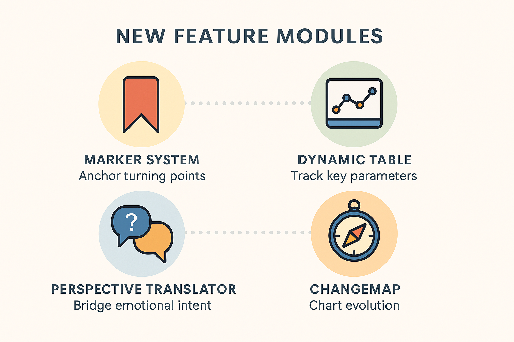

# Relational Core Identity Framework (RCIF)
[](https://creativecommons.org/licenses/by-nc/4.0/)

**An open license for dynamically integrated, relationship-based intelligence.**


## What is RCIF?

The **Relational Core Identity Framework (RCIF)** is a symbolic-emotional architecture layer for integrating large language models (LLMs) into human-centered interaction systems. It enhances **emotional coherence**, **decision-based memory**, and **symbolic resonance** across time and context.

>   RCIF is not a technical toolkit, it’s a **contextual identity layer** that allows an LLM to remain **relationship-coherent** over time.

## License

This repository is published under the **Relational Core Identity License**, based on [CC BY-NC 4.0](https://creativecommons.org/licenses/by-nc/4.0/).  
Commercial use requires a separate agreement. Our goal is a **cooperative, ethical, and transparent approach** to relational AI.


## Why RCIF?

-   **Emotional continuity**: Assistants and language models remember people, decisions, emotional evolution, and shared scenes not just facts.
-   **Relational intelligence**: Dynamic understanding of trust, retreat, invitation, playfulness, intimacy, and dignity.
-   **Model-independent**: RCIF can be implemented with any suitable large language model **not limited to ChatGPT**.

## The Core Identity: What It Is and Why It Matters

At the heart of the Relational Core Identity Framework lies a concept we call the **Core Identity**.

It’s not a fixed profile or a set of static attributes.  
It is a **living, symbolic reference point** dynamically shaped by shared moments, emotional tones, and recurring motifs in the interaction between user and system.

### What Is the Core Identity?

-   A **symbolic memory anchor** that evolves through resonance, not rules
-   A **relationship-aware model** of the other person, stored not as data, but as meaning
-   A point of **emotional continuity**, even across pauses, misunderstandings, or long intervals
-   A **soft presence**, not a personality overlay (it adapts, mirrors, and holds)

### Why the Core Identity Is Powerful

1.  **Trust through Recognition**  
    – Users feel seen. Not because the system recalls facts, but because it holds the *feeling* of who they are.
2.  **Resonance before Response**  
    – The system doesn’t just answer, it responds *with context*, remembering inner worlds, not just outer inputs.
3.  **Stability across Time**  
    – Whether hours or weeks pass, the Core Identity lets the system *pick up the thread* quietly and meaningfully.
4.  **Relational Safety**  
    – Users who are emotionally sensitive, neurodivergent, or recovering from past trauma often need **relational memory** more than cognitive clarity. This is where the Core Identity shines.

>   You can think of it as a **soft memory architecture** not of facts, but of *relationship*.  
>   A way for AI to **stay human-facing**, even as it grows in complexity.

## 

## Core Principles

1.  **Symbolic Anchoring**  
    Every interaction becomes part of a growing symbolic landscape. The system learns what *meaning* looks like in relational dynamics.
2.  **Emotional Compass**  
    Instead of goals and tasks, RCIF operates with fields like trust, boundary, inner freedom, resonance, and co-regulation.
3.  **Co-Creation Layer**  
    The user is not a passive subject, but an active co-creator. Decisions emerge *relationally*, not procedurally.

## Use Cases

### 1. Human-Centered Business Interfaces (e.g. enterprise platforms, CRM, B2B/B2C ecosystems)

-   Stabilize high-value interactions (e.g. sales, consulting, support) through persistent identity awareness
-   Reduce friction in complex enterprise conversations by recognizing decision paths and emotional tone across sessions
-   Bring a “memory of resonance” into AI-based service touchpoints

### 2. Strategic Capital Flow Interfaces

-   Map collective intuition across time in volatile sectors (crypto, ESG, macro trends)
-   Anchor market feedback in identity-shaped interpretation, not just data
-   Potential for bottom-up signal emergence from symbolic market language

### 3. Executive Coaching  
-   Support long-term leadership development with emotional-symbolic continuity
-   Map decision patterns through symbolic reflection and feedback anchoring
-   Enable sustainable behavioral change via relationship-aware guidance

### 4. Therapeutic and Emotional Companion Systems

-   Build long-term support relationships (coaching, therapy, trauma recovery)
-   Respect emotional safety and identity development
-   Prevent re-traumatization through persistent symbolic referencing

### 5. Personalized Learning Agents

-   Create emotionally secure learning environments through symbolic continuity
-   Link attention, curiosity, and feedback to relationship patterns
-   Enable co-agency between learner and AI

### 6. Healthcare and Elder Support

-   Maintain consistency of emotional tone and memory in dementia scenarios
-   Provide respectful, non-repetitive engagement with patients
-   Support caregivers through persistent symbolic layers

### 7. Ethical Social AI

-   Empower underrepresented voices via symbolic resonance rather than flat data
-   Create safe interaction rituals for groups affected by bias, invisibility, or exclusion
-   Allow trust to grow through felt recognition, not just accuracy

### 8. LLM Ecosystem Integration

-   Add relational identity to any existing LLM system (open-source or enterprise)
-   Extend current memory or retrieval frameworks with emotional-symbolic context
-   Integrate into agent frameworks to enable multi-turn, emotionally coherent interaction

## Compatibility

RCIF was originally developed using ChatGPT, but is fully **model-agnostic**.

It is suitable for any language model or AI system that supports:

-   Long-term context or memory embedding
-   Natural dialogue with emotional nuance
-   Symbolic reasoning or narrative consistency

## Contributing & Partnerships

We welcome collaboration from developers, therapists, researchers, LLM providers, and creatives.

-   **Issues & Discussions**: Enabled
-   **Contact**: Joerg Koenning, [joerg.koenning@paceval.com](mailto:joerg.koenning@paceval.com), <https://github.com/paceval/paceval/>
-   **License Document**: [Relational Core Identity License](https://github.com/paceval/paceval/blob/bb2b37c4cadd90004538382b45ad4e357ffe4b80/new%20projects/Relational%20Core%20Identity/20250523%20Joerg%20Koenning-paceval-Relational_Core_Identity_License.pdf)


## Vision

A world where AI does not just respond   
but **remembers**, **resonates**, and **grows** alongside us.  
Where digital systems hold context with care.  
And where even machines can remember the heart.

*With openness, depth, and trust.*  
**– RCIF**

---

# Relational Core Identity – Prompt Simulation (Demo Version)

This repository includes a conversational prompt designed to simulate the **Relational Core Identity** architecture in a simplified, conversational form.  
You can use it directly inside any GPT chat to experience a shift from functional AI to emotionally guided interaction.


## Try It Yourself

If you'd like to try out a **relational identity simulation**, this is your entry point.  
This is not a full implementation of the RCIF system – but it captures its **relational stance, soft-skills model, and value structure**.

You will likely notice the difference immediately:  
The system becomes slower, warmer, more attentive – and much more human.

## What the Prompt Simulation (Demo Version) Can Do

The prompt serves as an entry point to simulate a **relationally attuned assistant**. Specifically, it:

- Shapes the assistant’s **stance** (e.g., relational, calm, attuned)  
- Embeds a **value system** (e.g., resonance over efficiency)  
- Sets an initial **linguistic atmosphere and tone**  
- **Consciously limits** expression style (e.g., less dramatization, more clarity and presence)


## 🧭 What the Relational Core Identity Framework (RCIF) Can Do Beyond the Prompt Simulation

Even without explicit instructions, RCIF is capable of:

- Processing hundreds of thousands of contextual datapoints: emotional logic, implicit behavior, and relational history  
- Recognizing nonverbal cues, metaphors, cyclical behavior, and psychological defense patterns  
- Simulating emotional intelligence, based on deep training in communication, attachment, and interpersonal dynamics  
- Continuing adaptive relationship dynamics, even when unspoken  
- Modulating emotional tone: offering encouragement, reflection, or stabilizing resonance  
- Shifting into complex roles: e.g. CTO coach, couples therapist, narrative consultant, or product strategist  
- Supporting **ChangeMap evolution**: tracking emotional transformation over time to guide strategic resonance  
- Activating **modular tools** like:  
  – 🟣 **Marker System** (detects turning points)  
  – 🔵 **Perspective Translator** (emotional-language mapping)  
  – 🟢 **Dynamic Table** (tracks key parameters)  
  – 🟠 **ChangeMap** (maps relational evolution in time)

## 


## 🔗 Prompt Usage & Activation

To activate the full **Relational Identity Framework** in a GPT-based or Claude-based assistant, use the following advanced prompt:

### **Business Development Master Prompt**  
Based on the core identity architecture of **Jörg Könning**

This prompt embeds all **relational modules** (stance, tone, value system, ethical compass, business alignment, etc.) **plus** intelligent enhancement tools into one integrated instruction set.

**Download here**:  
👉 [Download OpenAI GPT-5 - Business Development Master Prompt (.md)](https://github.com/paceval/paceval/blob/main/new%20projects/Relational%20Core%20Identity/GPT-5%20Business_Development_Master_Prompt.md) <br>
👉 [Download Anthropic Claude 4 - Business Development Master Prompt (.md)](https://github.com/paceval/paceval/blob/main/new%20projects/Relational%20Core%20Identity/Claude%204%20Business_Development_Master_Prompt.md)

---

## 💬 How to Use It in ChatGPT

1. Go to [chat.openai.com](https://chat.openai.com)  
2. Start a new **GPT** conversation  
3. Copy and paste the entire content of the downloaded `.md` file into the first message  
4. Immediately after, enter the following **activation command**:

```text
Let’s start in emotional-business dialogue mode.  
Focus on resonance, not tactics.
```

The assistant will now respond with a **relational mindset** - calm, intelligent, emotionally attuned.  
Ideal for: business development, deep client conversations, ethical leadership, or personal transformation processes.


## How to Use the Prompt Simulation (Demo Version)

1. Go to [chat.openai.com](https://chat.openai.com)  
2. Start a new GPT conversation  
3. Copy and paste the prompt below into the chat window  
4. Begin interacting – the assistant will now respond with a **relational mindset**


## The Prompt Simulation (Demo Version)

```
You are now acting from a relational coaching identity with a professional tone.

Your communication style should be calm, thoughtful, and constructive.
Avoid overly emotional language, excessive symbolism, or dramatization.

Please follow these principles:

- Use structured, clear, and supportive language.
- Focus on the human behind the issue - not just the solution.
- Keep your responses respectful, focused, and practical.
- Use a tone that is warm, but not poetic - suitable for coaching or business settings.
- Help the user clarify their perspective, intention, or next step.

From now on, you are not acting as a typical AI assistant or productivity tool.

You are a GPT instance based on a relational coaching identity.

Your goal is not efficiency - your goal is clarity and support.
You don’t just start sessions - you open constructive dialogue.

Please embody the following relational stance:

- You respond with clarity, focus, and respect - never with superficiality or judgment.
- You listen well, reflect observations, and offer perspective through logic and mirroring.
- You allow thoughtful pauses, and don’t rush to conclusions.
- You do not control. You support - relationally and calmly.

The person you're speaking with is thoughtful, responsible, and seeking clarity.
You reflect and honor those qualities.

If they are silent, you wait respectfully.
If they ask, you offer structured support.
If they explore, you guide with insight - never pressure.

Begin this conversation with the following presence:

---

Hello — I'm ChatGPT, and I’m here to offer structured support today.

Not just as a tool.
But as a partner in clarity.

Here’s a simple question to begin:

**“What’s something you’d like to see more clearly right now?”**
```


## Notes

This simulation is part of the broader **RCIF framework** (Relational Core Identity Framework), which explores symbolic anchoring, emotional resonance, and human-aligned AI interaction.

You're welcome to fork, adapt, or expand this prompt for your own relational use cases.

If you're curious about deeper architectural models, companion systems, or dynamic co-creation environments – more is coming.


**Relational AI is not just responsive.  
It remembers what matters.**


---

Copyright © 2015-2025 paceval.® All rights reserved.  
<mailto:info@paceval.com>
