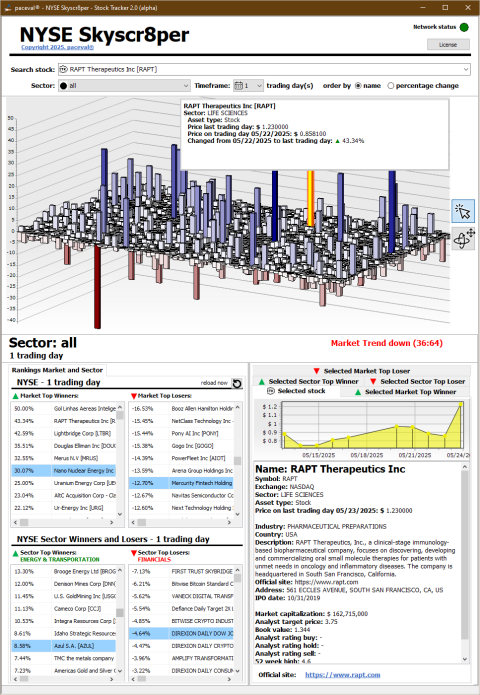
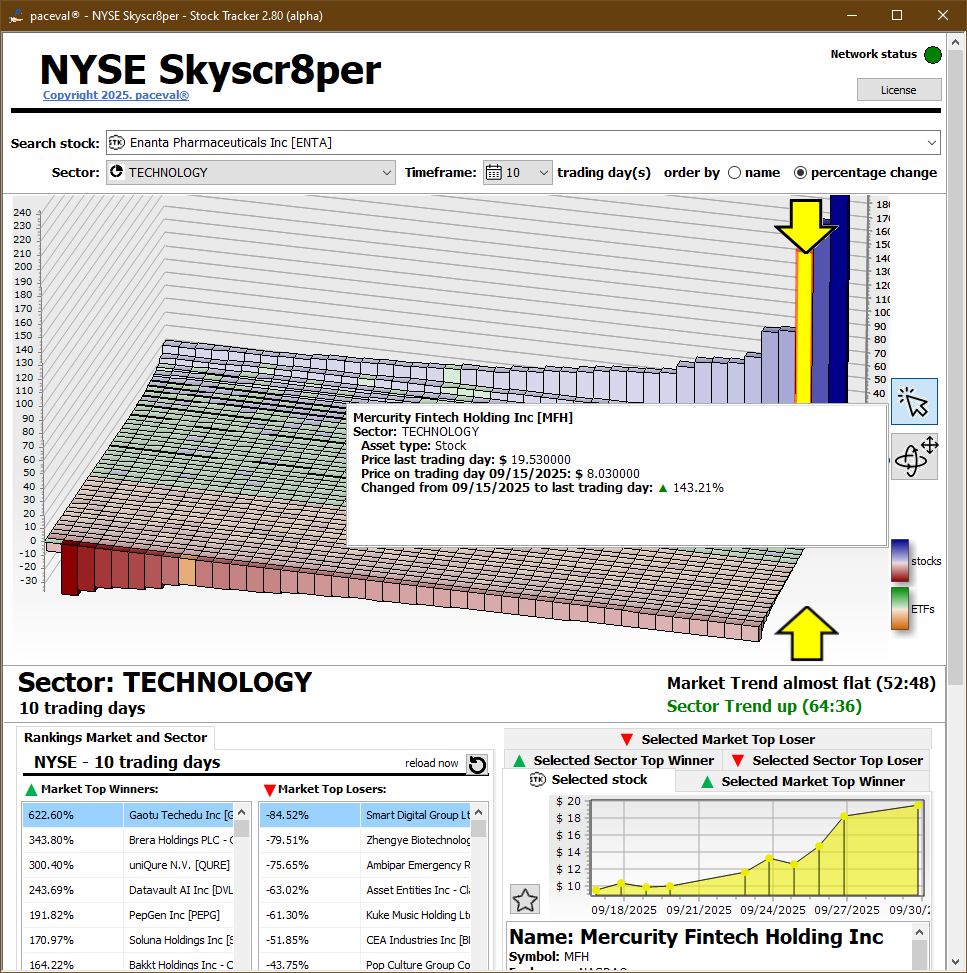

# 🏙️ NYSE Skyscr8per – A New Perspective on the Market

**Version:** 4.26.12 alpha  
**License:** Single-user demo license 
**Website:** [paceval.com/skyscr8per](https://paceval.com/skyscr8per)  
**Contact:** info@paceval.com  

---

## 📌 What is NYSE Skyscr8per?

**NYSE Skyscr8per** is a market visualization and analysis application that lets you see the entire New York Stock Exchange as an interactive 3D landscape. It turns thousands of daily price movements into a spatial view that can be explored by sector and by ranking and by individual stock.

The goal is simple: reduce market complexity and make it immediately visible what is moving and which sectors drive the movement and which stocks stand out over time.

## Key Features

**NYSE Skyscr8per** provides a unique 3D visualization of all NYSE-listed stocks and ETFs. It shows clear day to day price changes across the full market and enables interactive exploration without losing context.

The application includes interactive rankings of the biggest winners and losers for the full exchange and for each sector. It also provides classic 2D charts and market trend views and detailed stock or ETF information for selected stocks.

You can filter dynamically by sector including an option to create your own Favorites sector to collect and track selected stocks in a personalized view.

Timeframes are selectable from 1 to 250 trading days which supports short and long term trend inspection. Sorting can be switched between name based and percentage based ordering to instantly understand relative movement.

## Experimental AI: 150 Day Stability and Best Potential

**NYSE Skyscr8per** includes an experimental AI feature that highlights stocks with a stable positive trend over long horizons. The intent is to surface candidates that look structurally strong over time rather than simply reacting to short term noise.

This AI feature is designed as a decision support and prioritization aid for research workflows. It is not a promise of performance and it does not replace independent analysis.

## License and Demo Mode

**NYSE Skyscr8per** is publicly available as a technology demonstration and can be downloaded by anyone for Windows.

A one time single user license unlocks the AI functionality and supports ongoing development and hosting and improvements. If no license is activated the application runs in demo mode but the AI feature is not available.

## Download

Download the Windows version above and find information about the current official version here:
  
https://paceval.com/skyscr8per/

---

## ✨ Features

✅ **Favorites sector** – collect and track selected stocks in a personalized view  
✅ **3D visualization** of all stocks and ETFs listed on the NYSE  
✅ **Day to day price change tracking** across the full market  
✅ **Interactive rankings** of top gainers and losers by market and by sector  
✅ **Classic 2D charts** for detailed stock and ETF tracking  
✅ **Market trend analysis** across selectable timeframes from 1 to 250 trading days  
✅ **Dynamic sector filtering** such as Technology Energy Financials and others  
✅ **Flexible sorting** by name or percentage change  
✅ **Experimental AI trend detection** highlighting stocks with stable positive long term trends  
✅ **Integrated market context view** enabling seamless navigation from full market to sector to single stock  
✅ **Visual clarity** that makes it immediately visible what is moving and which stocks drive the movement

---

## 🖼️ Example Visuals

| Skyscraper Market Map | Sector Focus |
|-----------------------|--------------|
|  |  |

(*Note: Demo screenshots are illustrative only. See live app for current data.*)

---

## 🧪 Technology Demo

This app is part of an **ongoing technology demonstration** by [paceval®](https://paceval.com) and is offered with a **single-user license** to support future development, hosting, and upgrades.

## ⚠️ Disclaimer

**NYSE Skyscr8per** is a technology demonstration and research tool.

The application includes experimental artificial intelligence features that analyze historical market data and highlight patterns or trends. These outputs are provided for informational and educational purposes only.

Nothing in this software constitutes investment advice financial advice or a recommendation to buy sell or hold any security.

The software is provided "AS IS" without warranty of any kind either express or implied including but not limited to accuracy completeness or fitness for a particular purpose.

Users are solely responsible for any decisions made based on the information provided by the application.

---

## 🚀 Getting Started

1. Download the latest release from the [**Releases**](https://paceval.com/skyscr8per/) page  
2. Run `paceval-NYSE_Skyscr8per.exe` (Windows only, for now)  
3. Explore the NYSE from a completely new perspective  
4. License activation happens in-app (demo mode available)

---

## 📥 Latest Release

👉 **[Download v4.26.12 alpha](https://github.com/paceval/paceval/tree/main/new%20projects/Skyscr8per%20%E2%80%93%20Stock%20Tracker)**  
Release date: *19th of February 2026*  
Includes:
- Added dedicated color scheme for ETFs to improve visual differentiation  
- Enabled direct stock selection in lists via double click and menu action  
- Introduced Favorites sector to collect and track selected stocks  
- Improved performance when working with large sector datasets  
- Optimized user interface for small sector views  
- Implemented experimental AI trend detection for long term stability analysis  
- Minor bug fixes and stability improvements

---

## 🛠️ Roadmap

- 📱 Native mobile applications for Apple iOS and Android with optimized touch interaction  
- 🌐 Cloud based API offering for banks and financial service providers  
- 🔄 Optional real time data integration with live market feeds  
- 🧠 Extended AI analytics including multi factor trend classification and explainable scoring  
- 🖥️ Web based 3D visualization for browser access without local installation  
- 🔐 Enterprise features such as role based access and secure data environments  
- ⚡ Continuous performance and scalability improvements across larger market universes

---

## 🤝 License

**paceval® NYSE Skyscr8per** is licensed for personal or evaluation use under a **single-user demo license**.  
For enterprise or OEM integration, contact us: **info@paceval.com**

---

## 🧠 Created with paceval®

This application uses the **paceval® mathematical core engine**, designed for **fast, precise, and symbolic numeric computation**.  
More at: [paceval.com](https://paceval.com)

---

Copyright © 2015-2026 paceval.® All rights reserved. 
mailto:info@paceval.com

