# paceval and artificial intelligence - Conversion of neural networks to closed-form expressions

paceval and artificial intelligence GitHub - <https://github.com/paceval/paceval/tree/main/paceval%20and%20artificial%20intelligence>

paceval at SwaggerHub - https://app.swaggerhub.com/apis-docs/paceval/paceval-service/4.23

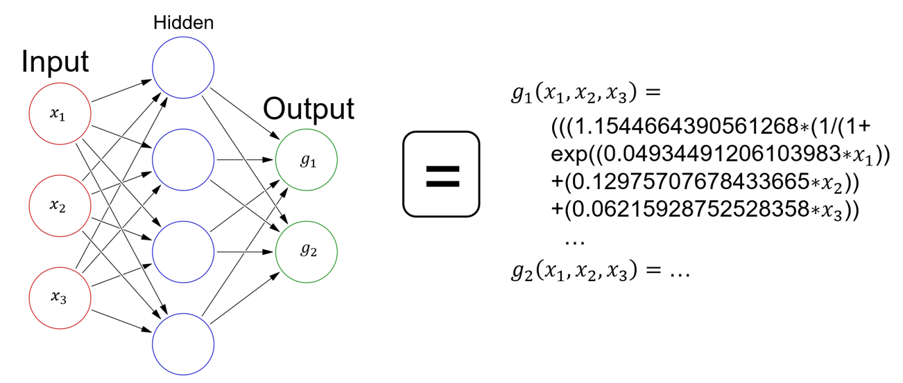

## INTRODUCTION AND OBJECTIVES OF THIS WHITE PAPER

Not all software or hardware systems provide an interface capable of manipulating tensors, and bringing neural networks into such systems can be an expensive challenge. It will then be advantageous to obtain closed formulas for the outputs of such networks. I.e. one would like to have a closed mathematical formula for each of the output neurons of a network, where only the inputs of the network are entered as parameters and the trained weights of the network as constants in the formula.

Closed expressions for the outputs of a neural network can also offer several advantages, making them an attractive option for certain applications.

-   First, **closed expressions with mathematical formulas can enable efficient computation** because they directly represent the relationship between the input and output variables without requiring iterative processes. This can be particularly beneficial in scenarios where computational resources are limited or where low-latency predictions are critical, such as in real-time systems or embedded devices.
-   Second, **closed expressions with mathematical formulas can simplify the integration of neural networks** with other mathematical models or systems, and enable seamless communication and analysis between different components. Such closed expressions can be created by analyzing the architecture of a neural network and manually constructing formulas for that specific architecture.
-   Third, the industry standard expects 99.9% or better accuracy for decisions. Because neural networks are black boxes, there is no transparent methodology to optimize artificial intelligence decisions and avoid degradation. In particular, it should be avoided that decisions that were made successfully in the past are decided differently today. This black box for AI is generally tacitly accepted. However, as Tommi Jaakkola, Professor of Electrical Engineering and Computer Science at MIT, puts it succinctly: “Whether it’s an investment decision, a medical decision, or maybe a military decision, you don’t want to just rely on a ‚black box‘ method”.   
    **Closed text format mathematical functions can provide a way to achieve industry standards** (e.g. when patching the mathematical functions).
-   Fourth, artificial intelligence decisions are often made with limited precision due to GPU technology. As an example, with bfloat16 with only 2-3 significant decimal places of accuracy, even with a simple neural network, a possible error would be suspected at the first decimal place. This can be fatal because it means that objects are potentially evaluated completely incorrectly without background knowledge in a black box.   
    A mathematical engine that processes neural networks and supports the IEEE standard for floating-point arithmetic such as 32-bit (float), 64-bit (double), 80-bit (extended), or future 128-bit (quadruple) **precision is evident much more precise and reliable in the mathematical calculations**.

This white paper describes the method to export each neural network into closed expressions with mathematical formulas.

**1. Source:** Norbert Wiener, an American mathematician and philosopher known as the founder of cybernetics: „I shall understand by a black box a piece of apparatus [...] which performs a definite operation [...], but for which we do not necessarily have any information of the structure by which this operation is performed.“, s. <https://uberty.org/wp-content/uploads/2015/07/Norbert_Wiener_Cybernetics.pdf>

**2. Source:** <https://www.technologyreview.com/s/604087/the-dark-secret-at-the-heart-of-ai/>

**3. Source:** A Mathematical Engine is a part of a computer program or a piece of computer hardware, referred to as engine, responsible for efficient processing of mathematical models. A Mathematical Model is an abstraction of a real-life scenario, system or event that uses mathematical language to describe and predict the behavior, dynamics and evolution of said scenario, system or event.

**4. Source:** The IEEE Standard for Floating-Point Arithmetic (IEEE 754) is a technical standard for floating-point arithmetic established in 1985 by the Institute of Electrical and Electronics Engineers (IEEE). The standard addressed many problems found in the diverse floating-point implementations that made them difficult to use reliably and portably.

### TENSORS

Modern frameworks for implementing artificial neural networks (like PyTorch, TensorFlow, Flux.ml and JAX) all work on the principle of performing calculations on multidimensional arrays called tensors. In both machine learning research and mathematics, tensors are multidimensional arrays that can represent a variety of mathematical objects such as scalars, vectors, and matrices. However, the use and interpretation of tensors in these two fields is somewhat different.

In the mathematical sense, tensors are algebraic objects that follow specific transformation rules when the coordinate system is changed. They can be represented by multidimensional arrays, but their true nature lies in the way they transform under different bases. Tensors are used in various branches of mathematics and physics to study a wide range of phenomena, including curvature in differential geometry, stress and strain in continuum mechanics, and electromagnetic fields in physics.

In machine learning research, tensors are mainly used as data structures to efficiently represent and process multidimensional data. They are the fundamental building blocks for many machine learning models, especially deep learning architectures like neural networks. In this context, tensors are often treated as multidimensional arrays, and the focus is on their numerical properties and efficient computation rather than their transformation properties under different coordinate systems. Machine learning frameworks such as TensorFlow and PyTorch provide numerically optimized tensor operations, which form the backbone of various machine learning algorithms.

### AUTOMATIC DIFFERENTIATION

All frameworks not only allow the manipulation of and calculations with tensors, but also provide a method for automatic differentiation. Auto-differentiation is an indispensable technique in artificial neural network (ANN) training because it allows for the efficient computation of gradients to update the model parameters.

In the context of ANNs, tensors are used to represent both the data and the parameters of the model, facilitating the processing of multidimensional information throughout the network.

In automatic differencing, the chain rule from calculus is used to calculate the gradient of a scalar loss function with respect to the parameters of the model, which are usually represented as tensors. The loss function quantifies the discrepancy between the network's predictions and the actual target values, and minimizing it is the main goal of training ANNs. By calculating the gradients, the learning algorithm, e.g. stochastic gradient descent or its variants, can adjust the parameters of the model in such a way that the loss function is minimized, which ultimately improves the prediction performance of the network.

Modern deep learning frameworks such as TensorFlow, PyTorch, and Flux.ml offer efficient, built-in auto-differentiation capabilities that streamline the training process of ANNs and allow dealing with complex architectures. From a practical point of view, the calculation of the gradients is performed by modern frameworks behind the scenes: calculations are performed on the tensors (the so-called "forward pass") and a fully automatic, so-called "backward pass", calculates the gradient of all performed calculations with respect to certain ones Tensors (generally the tensors containing the model weights).

### NEURAL NETWORK ARCHITECTURES

Artificial neural networks are made up of a series of interconnected layers, each of which performs specific functions to transform the input data into meaningful representations for accurate predictions. These layers can be roughly classified into three general types: input, hidden, and output layers. The input layer is responsible for receiving the raw data, while the output layer (in the case of a classification task) generates the final classification probabilities or decisions. Hidden layers, lying between the input and output layers, are made up of a variety of layer types, each designed to capture specific patterns and characteristics in the data. In traditional neural network architectures, information flows from one layer to the next in a strictly linear manner. However, more modern architectures often contain multiple paths, with information flowing through various parallel layers, with information being re-integrated at certain points. These modern designs allow for greater flexibility and adaptability when processing complex data patterns and learning intricate representations.

Common types of hidden layers include fully connected layers, convolutional layers, pooling layers, and normalization layers. Fully connected layers consist of neurons connected to all neurons in neighboring layers, enabling complex pattern recognition through linear combinations and non-linear activations. Convolutional layers, which play a central role in the development of convolutional neural networks (CNN), use spatially local connections and shared weights to exploit local patterns and reduce the number of parameters, making them particularly suitable for image classification tasks. Pooling layers, often used in conjunction with convolutional layers, shrink the spatial dimensions of the input, reduce computational complexity, and provide a form of translation invariance. Normalization layers, like stack normalization, are used to stabilize and speed up training by normalizing the activations within a layer.

CNNs are typically built by stacking multiple layers of convolution and pooling to form a hierarchical feature extractor, followed by one or more fully connected layers to perform the final classification. This architecture enables CNNs to effectively learn hierarchical features, from low-level patterns, such as edges and textures, to high-level abstractions, such as object parts and whole objects, ultimately resulting in robust and accurate classification performance.

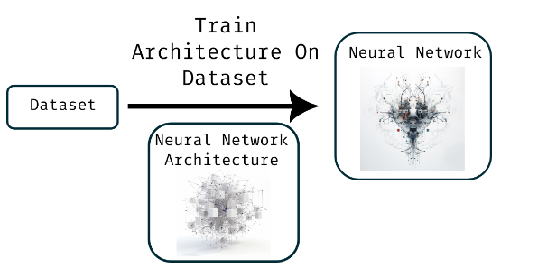

## METHODS

There are two general methods that can be used to automatically generate formulas for a given neural network: Static analysis of calculation graph or dynamic tracking.

Dynamic tracking has the great advantage that much of the infrastructure of existing machine learning frameworks can be reused, which is why we chose this approach.

### DYNAMIC TRACKING WITH THE PROGRAMMING LANGUAGE JULIA

The core concept of dynamic tracking is relatively simple: although these are tensor-based operations, each mathematical operation is ultimately performed on the elements (i.e. numbers) within the tensor. By replacing the numbers with a data type that not only contains the result of a calculation but also records all the calculations that led to that result, we can send input wrapped in such a record type across a network. This process would not only provide the result for a single input, but also the full formula of all the calculations that took place to produce the result at the output neurons.

While the basic idea is quite simple, implementing it in most programming languages and machine learning frameworks proves difficult, either because they do not support the definition of user-defined data types that are transparent enough to be easily sent through a neural network, or require very specific data types for performance reasons. For example, Python doesn't support defining user-defined data types in a way that makes them fully transparent to the system (meaning they behave the same as built-in data types), and C++-based systems often restrict the allowed data types for performance reasons.

The Julia programming language is a notable exception. Designed specifically for scientific computing, high-performance computing, and machine learning, Julia allows fully transparent user-defined data types to be defined. Also, most machine learning packages in Julia are written to handle such data types seamlessly. Therefore, we decided to implement the export methodology in the Julia programming language and use Flux.jl as a deep learning framework.

### IMPLEMENTATION DETAILS OF THE PROGRAM CODE

The RecordFormula data type referred to in the code is quite simple. It contains an actual value called "val" along with a list of operations performed to get the final result:

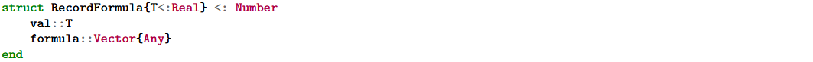

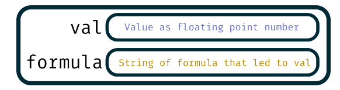

In addition, we need to define standard functions for our new data type: how to construct it from various other data types, how to do the automatic conversion of the wrapped values, what equality means, etc.:

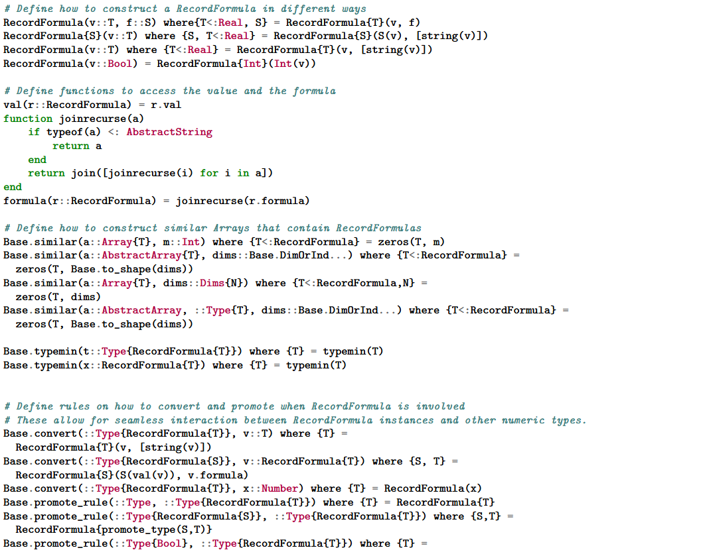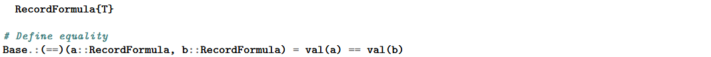

We can now override operators and standard functions that could be used with our new data type. In either case, we simply perform the operation or function and store the result in the value that the data type wraps, and record the operations and constants that result in that value:

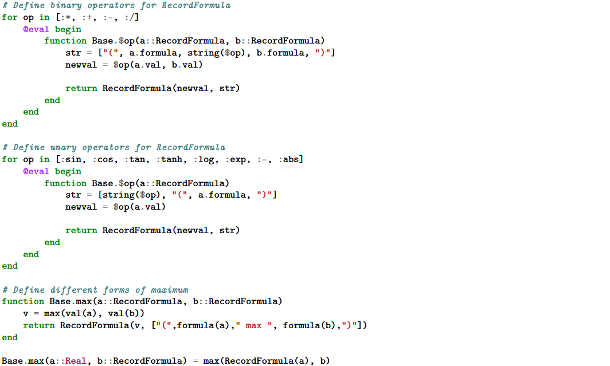

We can now wrap values in our data type, do arithmetic on them, get the result of the calculation with the "val" function, and use the "formula" function to find the calculations that led to that result. E.g.:

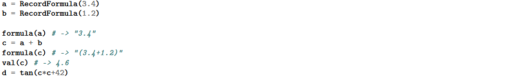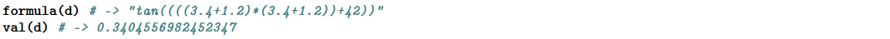

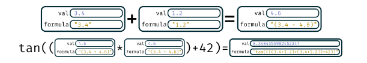

At this point we are able to define and train a neural network using Flux.jl as we would in any other DL framework. We take an example input tensor, wrap all of its values in a RecordFormula, send that RecordFormula tensor through the network, and retrieve the formulas from the output.

### OVERVIEW OF THE ENTIRE WORKFLOW

1.  Prepare the data set, split off a test set for evaluation, etc.
2.  Definition of the network architecture to be used
3.  Train the neural network on the data
4.  Wrap the elements of an input tensor into our dataset datatype
5.  Send this input tensor through the neural network
6.  Generate formulas from the operations recorded in the record data type
7.  Get everything in the format that **pace***val.* expects and save it along with input examples etc.
8.  Save example inputs and expected outputs in a format that can be used by **pace***val.*

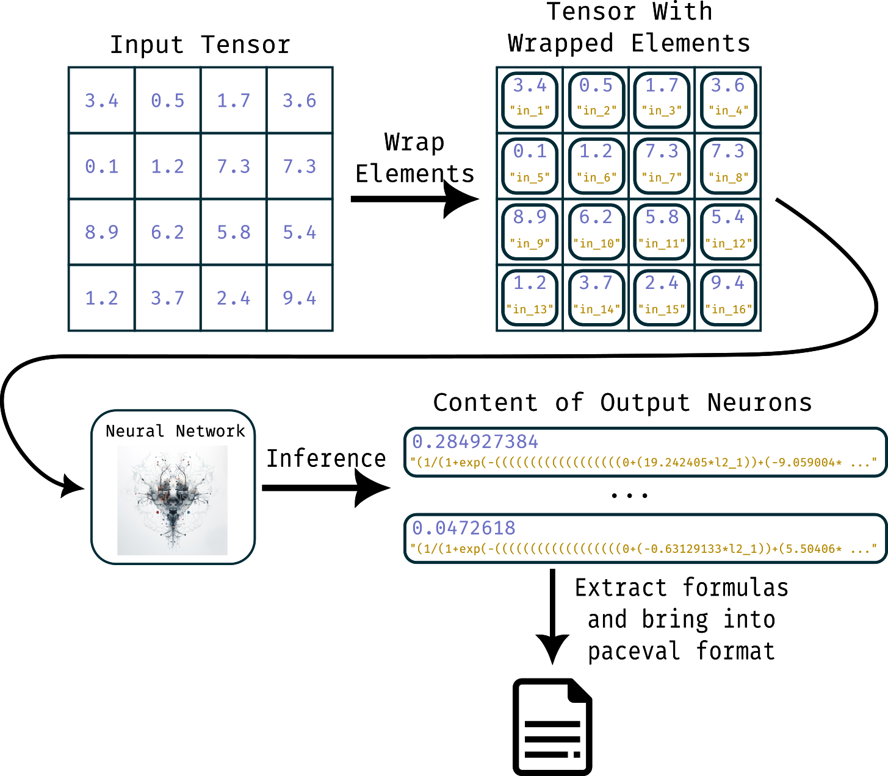

## IMPROVEMENTS AND SOLUTIONS

This is a very simple example implementation that already works for most neural networks. There are potential improvements to the current dynamic method in generating formulas from neural networks that we have presented here. In this section these potential improvements and already implemented solutions are discussed. We will not discuss specific networks that use branching paths or nonlinear elements in this white paper, but we would like to mention that there are solutions for these networks as well (if they are needed at all).

### EXPONENTIAL GROWTH OF EXPORTED FORMULAS

The generation of a closed expression for the output of a neural network becomes exponentially more complex as the depth of the network increases, due to the composition of the functions in each layer. In a deep neural network, the output is the result of a series of transformations, with each layer applying a set of weights and biases, followed by an activation function. With increasing depth, the number of functional compositions increases, which leads to a rapid increase in the complexity of the formula. This exponential growth results from the interactions between layers, as each additional layer multiplies the number of possible connections and functional combinations. Consequently, constructing a single closed expression for each output for such networks quickly becomes unsolvable.

Our solution to mitigate the exponential growth of complexity in generating a closed expression for the output of a deep neural network is to introduce intermediate variables at certain layers. With this approach, the overall formula is broken down into several smaller expressions, each representing a specific part of the network. By dividing the formula in this way, we can avoid unnecessary repetition and reduce the overall complexity of the expression. By using intermediate variables that denote the output of each layer, we can express the closed-loop equation for each layer in terms of those variables, rather than relying on a single, unwieldy formula. This method has already been applied in our sample code, so the depth of the neural network is no longer a problem.

This division and processing of the network with several smaller expressions obviously also has advantages on systems that allow parallel execution, such as multi-processor systems or FPGAs.

### GROWTH OF THE FORMULAS WITH INCREASING SIZE OF THE INPUTS

If you want to make decisions about a large number of inputs on a small system such as an IoT or IIoT device via a neural network, the system must be equipped with sufficient memory. To illustrate, let's take the pixels of an image as inputs to the neural network. The generation of closed formulas for all outputs of convolutional networks (CNNs) poses a major challenge even for medium image sizes, since the number of formulas required increases rapidly with increasing image size, since an image of e.g. 640 × 480 pixels has 307,200 inputs. CNNs use convolution layers to systematically scan the input image and extract valuable features, requiring numerous filters operating across the image. Consequently, as the image size increases, the number of calculations, parameters, and interactions between filters and spatial positions increases, resulting in a significant expansion of the number of formulas required to describe the behavior of the network. This is a fundamental fact that cannot be circumvented.

Larger filter sizes can help reduce the complexity of generating closed expressions for convolutional neural networks (CNNs) to some extent. Using larger filters allows the network to cover larger areas of the input image in fewer steps, reducing the number of calculations and interactions between filters and spatial locations. Also, by including the step size at which the filter moves across the image, the network can skip pixels, further reducing the number of calculations required. We used this method for the large network that detects faces in images. While these techniques can mitigate the complexity problem to some extent, they also have certain disadvantages. Larger filters can result in a loss of fine-grained spatial information as the filter covers more of the image and may miss smaller but important features and the network loses vital information about the input image.

A possible solution that works in general for a large number of inputs (which is not included in our example code) is to use a notation that makes it possible to specify recurring formulas (i.e. formulas that are repeatedly applied to different inputs). This approach would be a convenient means of representing convolution layers, since the main goal of these layers is to apply, for example, the same filter to an entire image. The introduction of such a notation would simplify the representation of convolutional layers and greatly improve the compactness of the closed formulas.

Copyright © 2015-2023 paceval.® All rights reserved.  
<mailto:info@paceval.com>
