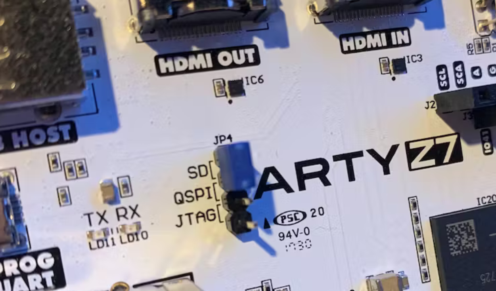
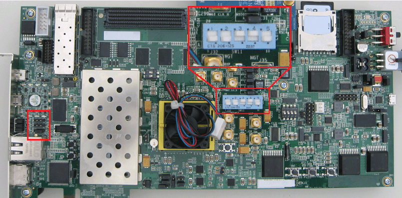
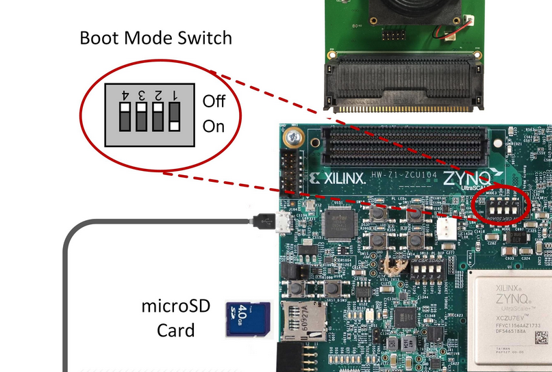
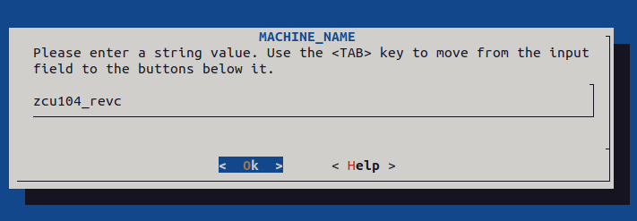
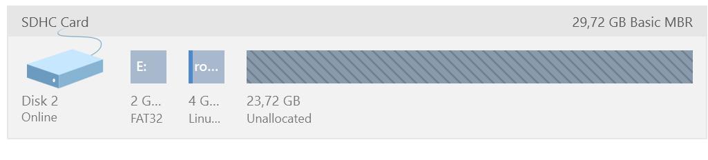
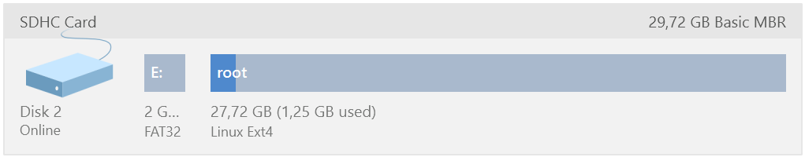
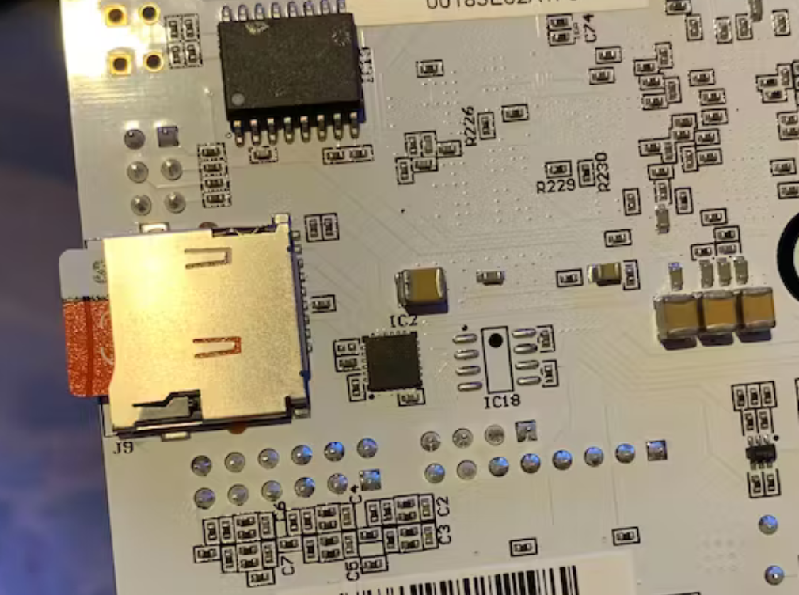
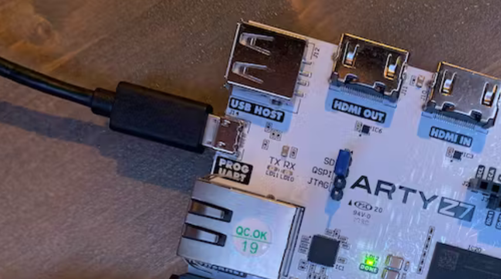
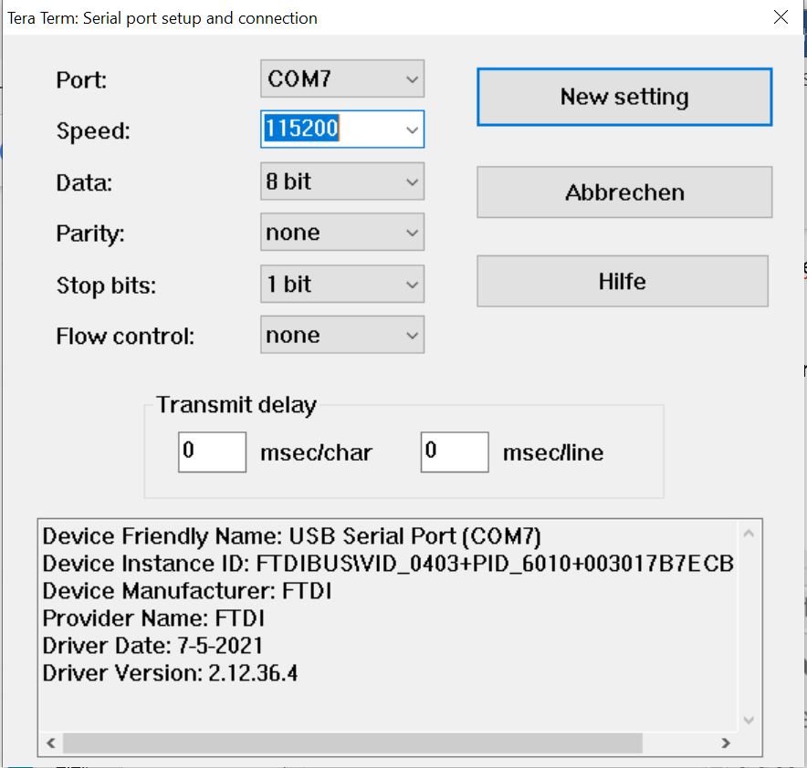

# paceval in hardware - the Mathematical Engine as a Service with an FPGA (e.g. for efficient Artificial Intelligence inference or fast Zero-Knowledge-Proofs)

paceval in hardware GitHub - https://github.com/paceval/paceval/tree/main/paceval%20in%20hardware

paceval at SwaggerHub - https://app.swaggerhub.com/apis-docs/paceval/paceval-service/4.23

## WHY DO I NEED A MATHEMATICAL ENGINE IN HARDWARE?

“In a digital world of the future, everyday life and the working world around us will be permanently supported by artificial intelligence. Data from countless sensors and actuators are read out by the smallest computers, processed, merged via a network of data links into larger nodes with more computing power, interpreted, fed back. They change, control, support, move our lives. In between sit huge data centers that take on the big tasks, manage and direct data, train artificial brains and solve complex scientific problems.

But this vision of a connected world currently comes at a high price. If global energy consumption for computing and communications increases at the same rate as it has been, it will take up the entire, global capacity for energy production as early as 2040. Energy consumption has been falling for a long time - because chip structures have become smaller and smaller. But this is where developments are now reaching their physical limits.

In order to implement our visions for the future - from autonomous driving to computer-aided drug development to intelligent control of countless renewable energy sources - fundamentally new computing concepts must therefore be found.”

Source: <https://www.sprind.org/en/challenges/newcomputing/>

## OUR TECHNOLOGY

Using new and existing technologies, a first reference design was developed that maps **pace***val.* in hardware with the required functionalities. This reference design is hardware based on a programmable System-on-a-Chip (SoC) from the AMD Xilinx Zync 7000 platform. The possible certification and subsequent official approval of an end product on this hardware should not be a problem, since the SoC already meets the high requirements of the automotive industry AEC-Q100.

The basic operating system on the SoC is PetaLinux as a so-called "Embedded Linux Distribution", as offered by Xilinx. Our application within PetaLinux is the paceval-service. This is set up to respond to HTTP requests on port 8080. The API provided by this service allows for the efficient evaluation of closed mathematical functions of any length and any number of variables. This allows all financial, stochastic, technical and scientific functions and in particular all machine learning models to be mapped. In addition, the usual standard mathematical notation can be used. Since the mathematical functions are available entirely in text form, there is a way to certify and then officially approve the software. In conjunction with the approval of the hardware, this results in an approved overall system, which is not possible per se for products based on neural networks today.

The chosen interface to communicate with our reference design is Ethernet. Of course, this can be changed as the SOC offers PCI Express, USB, Ethernet, SPI, SD/SDIO, I2C, CAN, UART and GPIO for communication in its entirety (the Xilinx ZC706 below). The selected software solution could also be easily transferred to a significantly more powerful multiprocessor system-on-a-chip (MPSoC) like the Xilinx ZYNC UltraSCALE+ platform (the Xilinx ZCU104 below). This not only enables small, energy-saving IoT and IIoT variants (the Digilent Arty Z7-20 below), but also large variants for data centers and in particular the well-known hyperscalers such as Amazon Web Services (AWS), Microsoft Azure and the Google Cloud Platform.

## HOW CAN I SET UP A MATHEMATICAL ENGINE WITH MY OWN FPGA?

We are currently using the Zync-7000 platform from AMD Xilinx for our development of **pace***val.* in hardware with these three developer boards:

-   Digilent Arty Z7-20, <https://digilent.com/reference/programmable-logic/arty-z7/reference-manual>
-   Xilinx ZC706, <https://www.xilinx.com/publications/prod_mktg/Zynq_ZC706_Prod_Brief.pdf>
-   Xilinx ZCU104, <https://www.xilinx.com/products/boards-and-kits/zcu104.html>

These boards have been selected by us based on customers' specific needs for mathematical efficiency versus total hardware cost (such as bill of materials) and integration. The Digilent Arty Z7-20 makes sense for small and medium-sized mathematical functions, the Xilinx ZC706 for medium-sized and large mathematical functions and the Xilinx ZCU104 for large to very large mathematical functions and data centers (e.g. hyperscalers).

Since the paceval-service itself running on the SOC only requires ARM32 or ARM64 support and no other specific requirements, the following description can also be applied to any other AMD Xilinx Zync-7000 platform development board.

Note: Currently, the paceval-service is implemented purely in software on the processing system (e.g. PetaLinux) and does not yet use the functions of the FPGA. We will use this GitHub to implement the FPGA functionalities in a timely manner.

This means that you can expect a lot more in the future in the following areas:

-   Speed
-   Efficiency (especially mathematics per watt)

However, the current values already look very promising (especially when you compare these values with those of a GPU that consumes a hundred times more power):

**Digilent Arty Z7-20 total On-Chip Power: 1.5 Watt**


**Xilinx ZC706 total On-Chip Power: 1.8 Watt**  


**Xilinx ZCU104 total On-Chip Power: 3.4 Watt**


# Setup

The following **description refers to the Digilent Arty Z7-20**, which is popular with makers, but which can easily be used for any other board with an SD card.


**Prerequisites:**

-   Vivado 2022.2 (or later) installed on Linux (and if necessary also on Windows)
-   PetaLinux installed on Linux

You can use alternatives for these programs:

-   Win32 Disk Imager installed on Windows
-   Paragon Partition Manager (e.g. Free version) installed on Windows
-   Tera Term installed on Windows

To boot from the SD card with the Digilent Arty Z7-20, jumper JP4 must be switched to SD as shown in the picture. This tells the ZYNC to look for bootloaders, kernel, filesystem, etc. on the SD card:



**A notice**

For the **Xilinx ZC706** please set the jumpers as follows:



**For the Xilinx ZCU104 please set the jumpers as follows:**

## Step 0 - Hardware Design

If you already have a hardware design, you can skip this step.

First you have to create a simple hardware design for the Digilent Arty Z7-20 under Vivago. This video is certainly useful for beginners:

<https://www.youtube.com/watch?v=i89v9T8Hdi0>

Then export the hardware including the bitstream in Vivado.

**A notice**

We have put simple hardware designs for the Digilent Arty Z7-20, the Xilinx ZC706 and the Xilinx ZCU104 on our GitHub:

**Digilent Arty Z7-20**

<https://github.com/paceval/paceval/tree/main/paceval%20in%20hardware/Digilent%20Arty%20Z7-20/manual%20setup> File “Vivado 2022.2 project-Digilent Arty Z7-20.zip”

**Xilinx ZC706**

<https://github.com/paceval/paceval/tree/main/paceval%20in%20hardware/Xilinx%20ZC706/manual%20setup> File “Vivado 2022.2 project-Xilinx ZC706.zip”

**Xilinx ZCU104**

<https://github.com/paceval/paceval/tree/main/paceval%20in%20hardware/Xilinx%20ZCU104/manual%20setup> File “Vivado 2022.2 project-Xilinx ZCU104.zip”

## Step 1 - Create the PetaLinux Project

You may have to adapt the project name, the options and the paths to your configuration for the following explanations and commands.

Enter the required commands for handling PetaLinux on Linux:

```
cd ~/petalinux/2022.2/
```

and

```
source settings.sh
```

Now we switch to our project directory

```
cd ~/petalinux/2022.2/projects/
```

and then we create the project:

```
petalinux-create --type project --template zynq --name xilinx-artyz720-2022.2 –force
```

Then we switch to the newly created project directory:

```
cd xilinx-artyz720-2022.2/
```

We copy our complete hardware design to a suitable directory under our project directory. In our case to   
\~/petalinux/2022.2/projects/xilinx-artyz720-2022.2/engine-202202

Then we configure the project with our copied hardware design:

```
petalinux-config --get-hw-description ./engine-202202/design_system_wrapper.xsa
```

This opens the user interface dialog for the configuration, where we will not make any changes for the time being.

**A notice**

For the Xilinx ZCU104, the MACHINE_NAME must be set to "zcu104_revc" in the user interface dialog:



Then we create the PetaLinux for our development board:

```
petalinux-build
```

This will take time. Once the PetaLinux creation is complete, we create the required files for the SD card

```
petalinux-package --force --boot --fsbl ./images/linux/zynq_fsbl.elf --fpga ./images/linux/system.bit --u-boot
```

and then create the image for the SD card:

```
petalinux-package --wic
```

We copy the generated image "petalinux-sdimage.wic" for the SD card from the directory "\~/petalinux/2022.2/projects/xilinx-artyz720-2022.2/images/linux/" to Windows.

Then we write the file "petalinux-sdimage.wic" to the SD card with the Win32 Disk Imager. In our case the SD card is in drive E:\\


Then we start the Paragon Partition Manager and increase the Linux root to the full free size of the SD card. This is necessary so that PetaLinux and our applications still have space to write on it. Ignore any warnings about increasing the Linux root.

Before:



After:



Install the SD card into its slot (J9) on the bottom side of the Digilent Arty Z7-20 board:



Plug a micro USB cable to the JTAG/UART USB host port J14 of the Digilent Arty Z7-20 board:



Open your serial terminal application of choice (e.g. Tera Term) with a baud rate setting of 115200:



And then you can watch the boot process.   
Up to here everything should have worked successfully and you can now configure the paceval engine.

To be continued …

Copyright © 2015-2023 paceval.® All rights reserved.  
<mailto:info@paceval.com>
