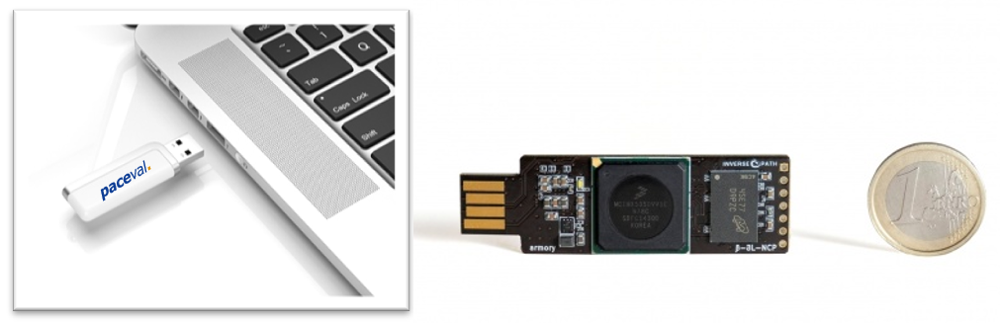

# paceval on a USB stick - the Mathematical Engine as a Service on a very small efficient hardware system (e.g. for local intelligence with Artificial Intelligence algorithms)

paceval on a USB stick GitHub - <https://github.com/paceval/paceval/tree/main/paceval%20on%20a%20usb%20stick>

paceval at SwaggerHub - <https://app.swaggerhub.com/apis-docs/paceval/paceval-service/>

## THE MAIN GOAL OF OUR SOLUTION WITH PACEVAL?

By making **pace***val.* available on the smallest efficient systems, local intelligence becomes possible on these systems too. This **enables completely new use** cases, as customer-specific requirements of artificial intelligence can be implemented without a permanent network connection to large, mostly cloud-based systems. There are many algorithms for artificial intelligence in addition to neural networks (see <https://github.com/paceval/paceval/tree/main/paceval%20and%20artificial%20intelligence>) that can thus be implemented locally, e.g. linear regression, logistic regression, decision trees, random forest, support vector machines, k-nearest neighbours, naive Bayes, k-means clustering, principal component analysis or gradient boosting machines. Of course, many other obvious examples can be found, such as weighted directed graphs, differential equations, scalar products, geometric transformations, matrix and vector operations, hidden Markov models for fast gesture recognition, transformations (DCT, FFT), Newton's method, singular value decomposition, polynomials, eigenvalues, cyclic redundancy checks, zero-knowledge proofs and generally almost all topics of numerical mathematics.

You can therefore implement customer-specific local intelligence that **runs as a standalone system independent of the main system** (e.g. a laptop). This standalone system can be protected from security. In particular, it cannot be manipulated by the user.

**Such a new system is**

-   **energy** efficient
-   minimally small in **size**
-   extremely **scalable**
-   very **cost**-effective

**Example use case:** Local intelligence in the car with the information from the manual and additional information about the specific type of car.

## OUR TECHNOLOGY

Similar to the [paceval in hardware](https://github.com/paceval/paceval/tree/main/paceval%20in%20hardware) systems already presented, we have implemented **the paceval-service as an example on the Armory Mk II USB stick**. The basic operating system on the USB stick is Debian Linux. The image can be downloaded from <https://github.com/usbarmory/usbarmory/wiki>. Our application on the USB stick is the well-known paceval-service. This is set up to respond to HTTP requests on port 8080. The API provided by this service allows for the efficient evaluation of closed mathematical functions of any length and any number of variables. This allows all financial, stochastic, technical and scientific functions and in particular all machine learning models to be executed. In addition, the usual standard mathematical notation can be used. Since the mathematical functions are available entirely in text form, there is a way to certify and then officially approve the software. In conjunction with the approval of the hardware, this results in an approved overall system, which is not possible per se for products based on neural networks today.

**USB Armory Mk II with a single ARM core**

## HOW CAN I SET UP A MATHEMATICAL ENGINE ON A VERY SMALL EFFICIENT HARDWARE SYSTEM?

Simply download the image with these two files from <https://github.com/paceval/paceval/tree/main/paceval%20on%20a%20usb%20stick/USB%20armory%20Mk%20II>:

1.  File “32GB_sdimage_ZC706_paceval-engine_usb_armory-mark-two.zip”
2.  File “32GB_sdimage_ZC706_paceval-engine_usb_armory-mark-two.z01”

Then unpack the image and write it to a 32 GB SD card for the Armory Mk II USB stick. You can use the Win32 Disk Imager for this, for example. Then plug the USB stick into a Windows laptop. After a maximum of 90 seconds, the paceval service will be available as a standalone separate coprocessor at the IP address 10.0.0.1 and port 8080. This coprocessor can then be queried in the same way as our description for the paceval-service for servers, as described here on SwaggerHub: <https://app.swaggerhub.com/apis-docs/paceval/paceval-service/>

**Example:**

[http://10.0.0.1:8080/Demo/?functionString=-sin(x\*cos(x))\^(1/y)&numberOfVariables=2&variables=x;y&values=0.5;2&interval=yes](http://10.0.0.1:8080/Demo/?functionString=-sin(x*cos(x))%5e(1/y)&numberOfVariables=2&variables=x;y&values=0.5;2&interval=yes)

If you want to access Linux on the hardware,  
the username is: **paceval**  
and the password is: **paceval**

**Please note:** These images were created with paceval version 4.24. If the version 4.24 libraries in the images have already expired, they cannot be executed. **To solve this, however, you simply need to copy the current paceval libraries for ARM 32bit into the /home/paceval/arm32 directory on your hardware. And if you want, the appropriate examples too.**

All currently valid and executable libraries and examples can be found in our current paceval SDK on our homepage <https://paceval.com> and also on our paceval Github in these directories  
<https://github.com/paceval/paceval/tree/main/paceval%20libraries>  
<https://github.com/paceval/paceval/tree/main/demo%20and%20examples>

# More information

We used the Debian base image from USB armory as a base, see <https://github.com/usbarmory/usbarmory/wiki/Available-images>.  
The paceval-service for 32-bit ARM that we use on the USB stick is located here: <https://github.com/paceval/paceval/tree/main/examples_sources/NodeJS_examples/Linux/paceval-service_Linux_arm32>

What we use in addition to NodeJS and PM2 is a Linux swap file to be able to run larger mathematical logics or larger neural networks. The swap file is several gigabytes in size. Thanks to the swap file, we can easily run our MNIST example of a neural network for handwritten numbers multiple times in parallel.

Other useful links:

<https://www.withsecure.com/de/solutions/innovative-security-hardware/usb-armory>  
<https://wiki.elvis.science/index.php?title=USB_Armory>  
<https://groups.google.com/g/usbarmory/c/LTqt_fgQY7w>
